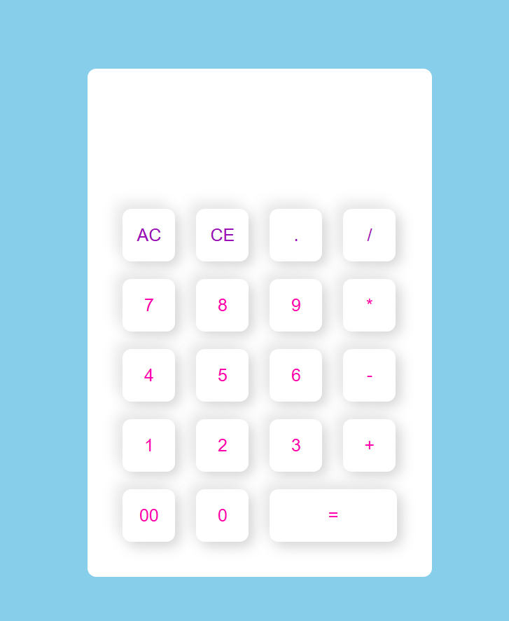

# CODSOFT
CODSOFT is an repository i am going to share my web development internship projects 
In this Repository contain coding of basic calculator using HTML , CSS  and JAVASCRIPT 
# Basic Calculator

This project is a simple, responsive calculator implemented using HTML, CSS, and JavaScript.

## Features

- Perform basic arithmetic operations: addition, subtraction, multiplication, and division.
- Clear entry (CE) and clear all (AC) functions.
- Responsive design that adapts to different screen sizes.
- User-friendly interface with styled buttons and display.
  
## Demo
You can view a live demo of the calculator [here]().

## Technologies Used

- **HTML**: Structure of the calculator interface.
- **CSS**: Styling for the calculator layout and buttons.
- **JavaScript**: Logic for calculator operations and user interactions.
